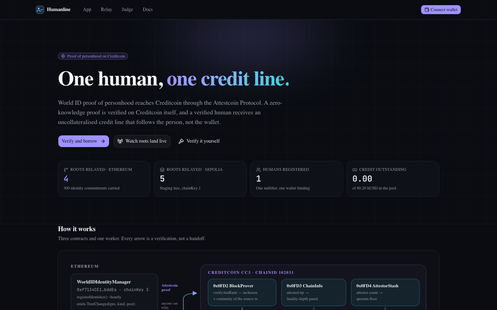

# Humanline

**One human, one credit line.** World ID proof of personhood reaches Creditcoin through the
Attestcoin Protocol, a zero-knowledge proof is verified on Creditcoin itself, and a verified human
receives an uncollateralized credit line that follows the person, not the wallet.

BUIDL CTC 2026 Fall submission, DeFi track. Live on Creditcoin CC3 testnet (chainId 102031).



<!-- Screenshots are captured from the live deployment: hero.png (landing), relay.png
     (the root feed), judge.png (the reproducibility page). -->

---

## Verify in five minutes

| | |
|---|---|
| Live app | https://humanline-alpha.vercel.app |
| Judge page (no wallet needed) | https://humanline-alpha.vercel.app/judge |
| Live relay feed | https://humanline-alpha.vercel.app/relay |
| Attestcoin write-up (the required technical documentation) | [`docs/ATTESTCOIN_INTEGRATION.md`](docs/ATTESTCOIN_INTEGRATION.md) |
| Relay evidence, one line per relayed root | [`evidence/relay-log.jsonl`](evidence/relay-log.jsonl) |
| Deployment record | [`deployments/cc3-testnet.json`](deployments/cc3-testnet.json) |

Six contracts, all verified on Blockscout:

| Contract | Address |
|---|---|
| `AttestedWorldID` (Ethereum mainnet, chainKey 3) | [`0x1122ef3fa4ab0693809e42a00b2476efcf4468ad`](https://creditcoin-testnet.blockscout.com/address/0x1122ef3fa4ab0693809e42a00b2476efcf4468ad) |
| `AttestedWorldID` (Ethereum Sepolia, chainKey 1) | [`0x3a7c3cc67034197208923587b8dc5c4674cbcef7`](https://creditcoin-testnet.blockscout.com/address/0x3a7c3cc67034197208923587b8dc5c4674cbcef7) |
| `HumanRegistry` | [`0x62c2fd99ea587e4b466175ad248468782bd5298d`](https://creditcoin-testnet.blockscout.com/address/0x62c2fd99ea587e4b466175ad248468782bd5298d) |
| `CreditLine` | [`0x1bd40163e41e44d2f139d95de88b640f6ea461f7`](https://creditcoin-testnet.blockscout.com/address/0x1bd40163e41e44d2f139d95de88b640f6ea461f7) |
| `hUSD` (test stablecoin, 6 decimals) | [`0x4bd7f4c6648deb8f107932572ce7e85aca259640`](https://creditcoin-testnet.blockscout.com/address/0x4bd7f4c6648deb8f107932572ce7e85aca259640) |
| `HumanGate` (example integration) | [`0xa3e021de49cec8819ea1bd37a8b5a9df005b776c`](https://creditcoin-testnet.blockscout.com/address/0xa3e021de49cec8819ea1bd37a8b5a9df005b776c) |

Three commands, no wallet, no funds:

```bash
bun install

# All three Attestcoin precompiles, supported chains with attested tips and bonded attestor
# counts, bn128 sanity, and the live state of both AttestedWorldID instances.
bun run worker/src/cli.ts check

# Take a real World ID transaction from Ethereum mainnet, fetch its Attestcoin proof, replay
# every on-chain guard locally, and verify it against the live 0x0FD2 precompile. Sends nothing.
bun run worker/src/cli.ts prove \
  0x81ece3110019bf17255ee88a9728ce4327319d7622e528645e8253cf36fdc7e3 \
  --source mainnet --dry-run

# 101 contract tests. Add CC3_FORK=1 to include the 7 that talk to the live Creditcoin node.
cd contracts && ../.tools/forge test
```

A relayed root, end to end, on public explorers: Ethereum mainnet
[`0xf321a814…728c2`](https://etherscan.io/tx/0xf321a814442cef61e60ada9e64a7c1fa388c787321af615a5e9f08cae3f728c2)
became Creditcoin
[`0xe764d3be…315dd`](https://creditcoin-testnet.blockscout.com/tx/0xe764d3be2bfa002d1f7db2e348daf5be410acc016ef6c4d7ebd797a5380315dd),
an `executeBatch` carrying two roots and 200 identity commitments under one Attestcoin continuity
proof.

---

## What it does

Humanline mirrors World ID's identity tree from Ethereum onto Creditcoin, where the only thing it
trusts is an Attestcoin proof of the real `registerIdentities` transaction that produced each root,
verified by the BlockProver precompile at `0x0FD2` inside the same Creditcoin transaction that
adopts it. A person then proves membership in that tree with a Semaphore zero-knowledge proof
verified natively on Creditcoin, which binds their World ID nullifier to a wallet. That nullifier,
not the wallet, is the key to a revolving uncollateralized credit line: repay on time and the limit
grows, default and the line freezes on the human forever, on every wallet they will ever hold.

## Why a wallet is not a person

Creditcoin exists to give credit history to people the banking system cannot see. Every
uncollateralized design on the chain has the same hole underneath it: a wallet is not a person. A
borrower can open ten wallets, repay themselves ten times, mint ten perfect credit passports, and
then default on the eleventh loan at full size. The history a lender is pricing against is erased by
a new keypair, which is why lenders keep asking for collateral from exactly the people who do not
have any.

Proof of personhood already exists. World ID's Orb-verified population is concentrated in Kenya,
Argentina, Indonesia, the Philippines, Brazil and Malaysia, which are Creditcoin's markets. The
problem is that World ID's identity tree lives on Ethereum, and the only ways to bring it to
Creditcoin have been a trusted bridge or a trusted oracle. Attestcoin removes both. That is the
whole reason this project can exist without an operator.

Every other credit passport in this hackathon can be forged by creating a new wallet. This one
cannot, because the nullifier is the human.

## How it works

1. **A root lands.** World's sequencer updates the identity tree on Ethereum about once an hour,
   emitting `TreeChanged`. A permissionless worker fetches an Attestcoin inclusion and continuity
   proof of that transaction and calls `execute` or `executeBatch` on `AttestedWorldID`. The
   contract verifies the proof through `0x0FD2`, then checks everything Attestcoin does not prove:
   receipt status, callee, log emitter, calldata against the log, root chaining, finality depth
   through ChainInfo `0x0FD3`, attestor quorum through AttestorStash `0x0FD4`, and one-time
   processing by query id.
2. **A human proves themselves.** The borrower produces a World ID Semaphore proof with their wallet
   address as the signal. `HumanRegistry.register` verifies it on Creditcoin, on the bn128
   precompiles, against a root that arrived through Attestcoin, and binds the nullifier to the
   wallet. Re-registering from a new wallet moves the binding; it never mints a second human.
3. **A line opens.** `CreditLine.openLine` gives that nullifier a 25 hUSD limit from an open lender
   pool. Borrow up to the limit, repay with a 1% term fee, and an on-time full repayment multiplies
   the limit by 1.25, capped at 2,000 hUSD. A late repayment halves it.
4. **A default sticks to the person.** Past the due date plus the grace period with a balance
   outstanding, anyone can call `markDefault`. The human is frozen permanently and the pool absorbs
   the write-off pro rata. Because the freeze is keyed by nullifier, a fresh wallet inherits it.

No owner, no pause, no upgrade path, in any contract. Every parameter is an immutable set at
construction. Anyone can run the relay.

## Built with

- **[Attestcoin Protocol](docs/ATTESTCOIN_INTEGRATION.md)** is the foundation, not a checkbox. Ten
  distinct surfaces are load-bearing: `verifyAndEmit` through `ASCBase.execute` as the only path a
  root can take, the batch `verifyAndEmit` overload behind a custom `executeBatch` with the
  protocol's 10-transaction and 1,000-block limits enforced on chain, `calculateTxIndex` as the
  replay key and the ordering evidence in the public `RootRelayed` event, `EvmV1Decoder` for both
  receipt-log decoding (`TreeChanged`) and independent calldata decoding of
  `registerIdentities` and `deleteIdentities` word layouts, emitter and status and callee binding,
  root chaining against a known `preRoot`, the ChainInfo `0x0FD3` finality guard
  (`get_latest_attestation_height_and_hash`, selector `0x809112da`), the AttestorStash `0x0FD4`
  quorum floor (`getAttestorsCount`, selector `0x8de0db2f`), roots dated by their source block using
  the attested tip, and two source chains running identical code. Remove Attestcoin and there is no
  root, no human and no credit.
- **World ID** provides the personhood. `AttestedWorldID` is World's own `WorldIDBridge` and
  `SemaphoreVerifier` from `world-id-state-bridge`, vendored unmodified, with the trusted state
  bridge replaced by Attestcoin proofs. It exposes the same `IWorldID.verifyProof` interface every
  World ID integration already uses.
- **Creditcoin CC3** runs all of it: the three Attestcoin precompiles, and the bn128 precompiles at
  `0x06`, `0x07` and `0x08` that make Groth16 verification possible natively rather than through a
  relayer's attestation.
- **Foundry** for contracts and tests, Solidity 0.8.28, `via_ir` (required: `EvmV1Decoder` is
  stack-too-deep under legacy codegen).
- **Bun** and TypeScript for the relay worker, with `@gluwa/usc-sdk` 0.18, ethers v6 and
  `bun:sqlite`.
- **Next.js 15** App Router with Tailwind, shadcn/ui, wagmi and viem, and `@worldcoin/idkit`, on
  Vercel.

## Architecture

```
ETHEREUM MAINNET (chainKey 3)             CREDITCOIN CC3 TESTNET (chainId 102031)
┌──────────────────────────────┐          ┌──────────────────────────────────────────┐
│ WorldIDIdentityManager (Orb) │          │ 0x0FD2 BlockProver  0x0FD3 ChainInfo      │
│ 0xf7134CE1…bddEa             │          │ 0x0FD4 AttestorStash                     │
│ registerIdentities() ~hourly │  proofs  ├──────────────────────────────────────────┤
│ emits TreeChanged(pre,kind,  │ ───────▶ │ AttestedWorldID (ASCBase + WorldIDBridge) │
│        post)                 │ worker   │  · verifyAndEmit → decode calldata + log │
└──────────────────────────────┘          │  · preRoot must chain to a known root     │
ETHEREUM SEPOLIA (chainKey 1)             │  · finality + quorum guards (0xFD3/0xFD4) │
┌──────────────────────────────┐          │  · rootHistory, 1-week expiry             │
│ Staging identity manager     │ ───────▶ │  · IWorldID.verifyProof (Semaphore/bn128) │
│ 0xb2ead588…7076 (simulator)  │          ├──────────────────────────────────────────┤
└──────────────────────────────┘          │ HumanRegistry  · nullifier ⇄ wallet       │
                                          │ CreditLine     · one line per nullifier   │
   World App / IDKit / Simulator ───ZK──▶ │ HumanGate      · example integration      │
                                          └──────────────────────────────────────────┘
```

Sequence diagrams for the relay path and the register-and-borrow path, plus a boundary-by-boundary
table of every value that crosses a trust boundary and what checks it, are in
[`docs/ARCHITECTURE.md`](docs/ARCHITECTURE.md).

## Repository layout

```
contracts/        Foundry project
  src/            AttestedWorldID, HumanRegistry, CreditLine, HUSD, examples/HumanGate
  src/interfaces/ IAttestedWorldID, IHumanRegistry, ICreditLine, IChainInfo, IAttestorStash
  test/           101 tests, including 7 that talk to the live CC3 node
  script/         Deploy.s.sol, DeployDemo.s.sol, deploy-cc3.sh, export-abi.sh
  vendor/worldid/ World's WorldIDBridge and SemaphoreVerifier, unmodified (MIT)
  abi/            exported ABIs, consumed by the worker and the web app
worker/           Bun relay CLI: check, bootstrap, prove, relay, status
web/              Next.js app: /, /app, /relay, /judge, /docs
deployments/      cc3-testnet.json (current) and cc3-testnet.v1.json (superseded)
evidence/         relay-log.jsonl, one line per relayed root
docs/             SPEC, ARCHITECTURE, SECURITY, ATTESTCOIN_INTEGRATION, VISION, DECK, SUBMISSION
.github/          relay.yml, the serverless relay fallback (30-minute cron)
.tools/           vendored Foundry (forge, cast, anvil, chisel)
```

## Getting started

Prerequisites: [Bun](https://bun.sh). Foundry is vendored under `.tools/`, so there is nothing else
to install. `bun install` at the repo root installs the `worker` and `web` workspaces.

Two environment notes that will otherwise cost you ten minutes:

- **Call Foundry as `../.tools/forge`**, not as `forge`. The vendored binary is pinned; a
  system-wide Foundry may differ.
- **The shell here is bash 3.2** (the macOS default), so `contracts/script/deploy-cc3.sh` uses
  tab-separated rows instead of associative arrays. Keep it that way if you edit it.

### Contracts

```bash
cd contracts
../.tools/forge build
../.tools/forge test                       # 101 tests, the 7 fork tests skip cleanly
CC3_FORK=1 ../.tools/forge test            # includes the 7 live CC3 tests
CC3_FORK=1 ../.tools/forge test --match-contract Fork -vv

PROFILE=demo script/deploy-cc3.sh          # deploy your own copy (needs a funded CC3 key)
script/export-abi.sh                       # refresh contracts/abi/*.json
```

`forge script` cannot target CC3: Foundry 1.5.1 cannot build an EVM environment from a CC3 RPC,
because CC3 block headers carry no `mixHash` and revm rejects the environment over `prevrandao`
before any script body runs. `deploy-cc3.sh` uses `cast send --create`, which never builds a local
EVM. `script/Deploy.s.sol` stays the canonical, tested description of the deployment.

### Worker

```bash
cd worker
bun run src/cli.ts check                            # read-only, no wallet
bun run src/cli.ts prove <txHash> --source mainnet --dry-run
bun run src/cli.ts relay --source all --once --dry-run
bun test                                            # 195 tests, no network

cp .env.example .env                                # CREDITCOIN_WALLET_PRIVATE_KEY to relay for real
bun run src/cli.ts relay --source all               # continuous, 60 s poll
bun run src/cli.ts status
```

Without `deployments/cc3-testnet.json`, every command that would send a transaction explains itself
and exits 2. `check` and every `--dry-run` path still work. See
[`worker/README.md`](worker/README.md).

### Web

```bash
cd web
cp .env.example .env.local                 # WORLD_RP_SIGNER_PRIVATE_KEY is server-side only
bun run dev                                # http://localhost:3000
bun run build
bun test                                   # 122 tests
```

Set `NEXT_PUBLIC_WORLD_ENV=staging` and scan the QR code with the
[World ID Simulator](https://simulator.worldcoin.org) to verify without an Orb. See
[`web/README.md`](web/README.md).

## Tests

| Suite | Count | Command |
|---|---|---|
| Contracts (Foundry) | 101, including 7 that run against the live CC3 node | `cd contracts && CC3_FORK=1 ../.tools/forge test` |
| Worker (Bun) | 195, no network | `cd worker && bun test` |
| Web (Bun) | 122 | `cd web && bun test` |

The 7 fork tests are the ones worth reading: they confirm that the real `0x0FD2` returns `true` for
both proof fixtures and agrees the mainnet transaction index is 173, that the real `0x0FD3` tracks
chainKey 3 as Ethereum and chainKey 1 as Sepolia with their attested tips, that the real `0x0FD4`
reports 4 and 7 bonded attestors against a floor of 3, and that the bn128 precompiles return the
right answers for known inputs.

Every attack in the threat model maps to a named custom error and a named test. The table is in
[`docs/ATTESTCOIN_INTEGRATION.md`](docs/ATTESTCOIN_INTEGRATION.md) section 7, and the full model is
in [`docs/SECURITY.md`](docs/SECURITY.md).

## Deployments

Creditcoin CC3 testnet, chainId 102031, RPC `https://rpc.cc3-testnet.creditcoin.network`, explorer
`https://creditcoin-testnet.blockscout.com`. The addresses are in the table at the top of this file
and in [`deployments/cc3-testnet.json`](deployments/cc3-testnet.json), which is generated by the
deploy script and read by both the worker and the web app.

The deployed profile is `demo`: `TERM` 600 seconds, `GRACE` 300 seconds, initial limit 25 hUSD, max
limit 2,000 hUSD, fee 100 bps, so a full borrow, miss and default cycle fits in a video.
`PROFILE=prod` uses 30-day terms and a 7-day grace period. `HumanRegistry` is pointed at the Sepolia
`AttestedWorldID` instance so personhood can be reproduced with the World ID Simulator; the mainnet
instance relays production Orb roots and both are live on `/relay`.

`deployments/cc3-testnet.v1.json` records an earlier deployment of the same six contracts, replaced
after a review round. It is kept so the first rows of the relay evidence log stay attributable.

## Demo and deck

- **Demo video (3 minutes):** {{VIDEO_URL}}
- **Pitch deck:** [`docs/deck.pdf`](docs/deck.pdf)
- **Product vision, business model and roadmap:** [`docs/VISION.md`](docs/VISION.md)

## Known limitations

Stated up front rather than discovered later. The full list, with reasoning, is in
[`docs/ATTESTCOIN_INTEGRATION.md`](docs/ATTESTCOIN_INTEGRATION.md) section 8 and
[`docs/SECURITY.md`](docs/SECURITY.md) section 3.

- **Attestcoin is read-only today.** State comes in from Ethereum; nothing goes back out.
- **There are no absence proofs.** A default is declared from a passed deadline plus the absence of a
  repayment in Creditcoin's own state, which is native. We never dress that up as a cross-chain
  claim.
- **Roots lag.** Source finality plus attestation plus a 32-block depth. Measured end to end at
  roughly 15 minutes for a freshly mined root. Someone Orb-verified five minutes ago cannot register
  yet, and the lag is shown on `/relay` rather than hidden.
- **Root history expires after one week**, World's own constant, and it now bites properly because
  roots are dated by their source block rather than by arrival.
- **World ID 3.0 dependency.** IDKit must be asked for legacy proofs. World ID 4.0 verification lives
  on World Chain; the roadmap answer is proving World Chain output roots through their Ethereum
  postings, which is the same pipeline with a different source contract.
- **Sybil resistance is exactly World's.** The guarantee is "one World ID, one line", not "one
  biological human, one line".
- **The attestor set is the deepest assumption.** A colluding quorum could attest to a block that
  does not exist. Humanline enforces a floor of 3 bonded attestors and a depth of 32 attested blocks,
  and cannot do better than the protocol it sits on.
- **The relay is single-operator today.** That is a liveness dependency, not a trust one: the worker
  is public, the contract does not care who calls it, and nothing is lost while nobody relays.
- **Testnet economics.** `hUSD` is a test stablecoin we mint, lender deposits are testnet funds, and
  no economic claim here has been tested with real money.
- **A freeze is permanent and there is nobody to appeal to.** There is no owner, including us. That
  is the design, and it is also a real product limitation a production version would address with a
  lender-controlled cure path written into the contract from the start.

## Team

| Field | Value |
|---|---|
| Name | Raj Karia |
| Role | Sole builder: contracts, relay worker, web app, documentation |
| Email | {{TEAM_1_EMAIL}} |
| Telegram | {{TEAM_1_TELEGRAM}} |
| X | {{TEAM_1_X}} |
| LinkedIn | {{TEAM_1_LINKEDIN}} |

## License

MIT. See [`LICENSE`](LICENSE).

Vendored third-party code keeps its own attribution: World's `WorldIDBridge` and `SemaphoreVerifier`
under `contracts/vendor/worldid/` are MIT and unmodified. The Attestcoin `ASCBase` and
`EvmV1Decoder` come from `@gluwa/asc-contracts` and are likewise unmodified. `IChainInfo.sol` and
`IAttestorStash.sol` were written from scratch under MIT rather than copied, because the upstream
precompile metadata in `gluwa/creditcoin3` is GPL-3.0-only.

Security reports: see [`docs/SECURITY.md`](docs/SECURITY.md) section 4.
