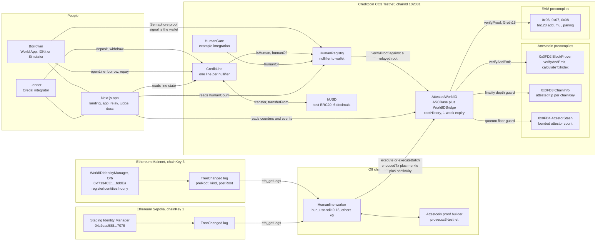
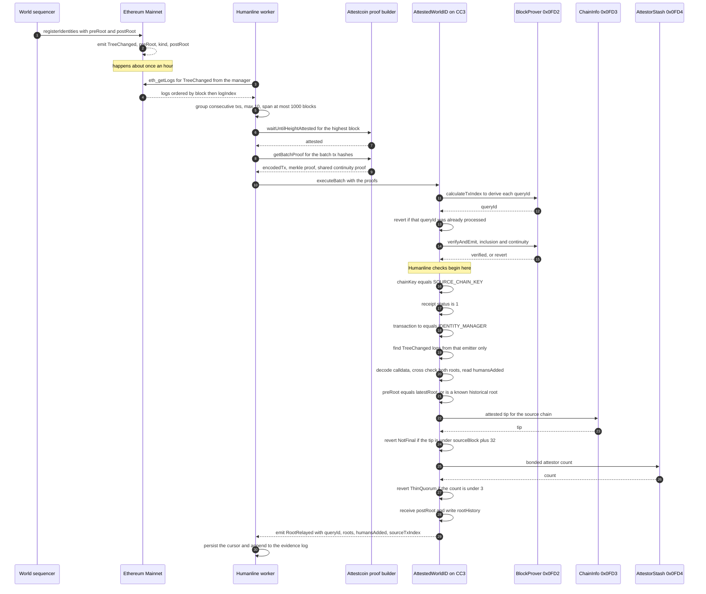
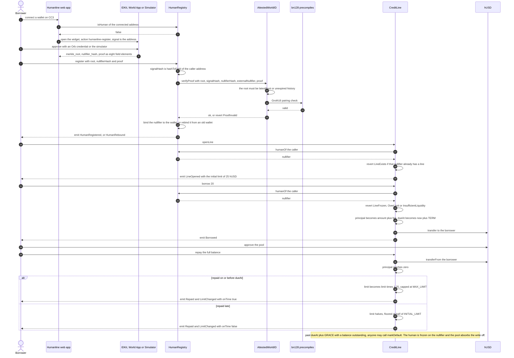

# Humanline: Architecture

Two chains, three precompiles, three contracts, one worker, and no trusted party anywhere in the path.

This document redraws SPEC §5. The flowchart shows what talks to what. The two sequence diagrams show the only two paths that matter: getting a World ID root onto Creditcoin, and turning a human into a borrower. The data-flow table at the end says, for every value that crosses a boundary, where it came from and what checks it.

Deployed addresses, CC3 testnet (chainId 102031):

| Contract | Address |
|---|---|
| `AttestedWorldID` (Ethereum mainnet, chainKey 3) | `0x1122ef3fa4ab0693809e42a00b2476efcf4468ad` |
| `AttestedWorldID` (Ethereum Sepolia, chainKey 1) | `0x3a7c3cc67034197208923587b8dc5c4674cbcef7` |
| `HumanRegistry` | `0x62c2fd99ea587e4b466175ad248468782bd5298d` |
| `CreditLine` | `0x1bd40163e41e44d2f139d95de88b640f6ea461f7` |
| `hUSD` | `0x4bd7f4c6648deb8f107932572ce7e85aca259640` |
| `HumanGate` | `0xa3e021de49cec8819ea1bd37a8b5a9df005b776c` |

The registry and credit line above verify against the **Sepolia staging** `AttestedWorldID`, so
anyone can reproduce the flow with World's simulator. A second set verifies against the **Ethereum
mainnet Orb tree**, with 30-day terms, for people who hold a real Orb-verified World ID:

| Contract | Address |
|---|---|
| `HumanRegistry` (Orb tree) | `0x53fcba2cd9296b22635c67d5e73777b4e5db96af` |
| `CreditLine` (30-day term) | `0x86e38ce7173288372b638c0b1839fc9c6923ab82` |
| `HumanGate` (Orb tree) | `0x544264e52a12fffa5c8640eb5a91b7f4628d5b93` |

Nothing else differs: both read the same two `AttestedWorldID` instances, both draw on the same
hUSD, and the web app switches between them at runtime. A registry is bound to exactly one identity
tree because a proof is only a member of one tree — that binding is an immutable constructor
argument, not a setting.

---

## 1. System diagram

Two instances of `AttestedWorldID` are deployed, one per source chain. They run identical code with different immutables. The mainnet instance carries production Orb roots. The Sepolia instance carries World's staging tree, which is what lets a judge reproduce personhood verification with the simulator instead of an Orb.

`HumanRegistry` points at exactly one of them, chosen at deploy time. Both are live and both are visible on `/relay`.

---

## 2. Sequence: root relay

From World's sequencer updating the identity tree on Ethereum to a usable root on Creditcoin.

The order of the checks is the security model. Inclusion is proven first, because nothing else is meaningful until it is. Then the transaction is bound to the right contract on the right chain. Then the calldata is made to agree with the log, which is the check that stops a genuine proof of a genuine transaction from being reinterpreted. Then continuity, which is the check that stops a genuine root from being adopted out of sequence. Then the environmental guards, finality and quorum, which are the checks that stop a technically valid proof from a compromised or immature source.

Only after all of that does a root enter `rootHistory` and become something a human can prove against.

---

## 3. Sequence: register and borrow

From a person holding a World ID to that person holding an uncollateralized credit line.

The step that makes this different from every wallet-scored design is the one that looks least interesting: `humanOf(msg.sender)`. Every entry point resolves the caller to a nullifier and keys state by that. Change the wallet and the line follows. Default, and the freeze follows too.

---

## 4. Data flow

Every value that crosses a trust boundary, and what checks it on arrival.

| # | Value | Origin | Carrier | Checked by | Consumer |
|---|---|---|---|---|---|
| 1 | `registerIdentities` transaction bytes and receipt | Ethereum mainnet or Sepolia | Attestcoin proof, built by the prover, submitted by the worker | `verifyAndEmit` on `0x0FD2`, inclusion against the attested block | `AttestedWorldID._processAndEmitEvent` |
| 2 | `receiptStatus` | Decoded from the proven receipt | `EvmV1Decoder.decodeReceiptFields` | Must equal 1, else `SourceTxReverted` | `AttestedWorldID` |
| 3 | Transaction `to` | Decoded from the proven transaction | `EvmV1Decoder.decodeCommonTxFields` | Must equal `IDENTITY_MANAGER`, else `NotIdentityManager` | `AttestedWorldID` |
| 4 | `preRoot`, `kind`, `postRoot` | `TreeChanged` log topics | `EvmV1Decoder.getLogsByEventSignature` | Emitter must be the identity manager, and exactly one such log must exist, else `NoTreeChange` or `AmbiguousTreeChange` | `AttestedWorldID` |
| 5 | `preRoot`, `postRoot`, `humansAdded` | Transaction calldata, words 8 and 11 and the commitments length | `decodeCommonTxFields(tx).data`, decoded in Solidity | Selector must be `0x2217b211` or `0xea10fbbe`, and both roots must equal the log topics, else `CalldataLogMismatch` | `AttestedWorldID`, and the `/relay` dashboard |
| 6 | Source chain attested tip | ChainInfo precompile `0x0FD3` | Direct read at relay time | Must be at least `sourceBlock` plus 32, else `NotFinal` | `AttestedWorldID` |
| 7 | Bonded attestor count | AttestorStash precompile `0x0FD4` | Direct read at relay time | Must be at least 3, else `ThinQuorum` | `AttestedWorldID` |
| 8 | `queryId` | `calculateTxIndex` on `0x0FD2`, over chainKey, block height and tx index | Computed in `ASCBase.execute` | Must not already be in `processedQueries` | `ASCBase`, and `RootRelayed` as ordering evidence |
| 9 | `postRoot` as an accepted root | Steps 1 through 8 | `WorldIDBridge._receiveRoot` | `CannotOverwriteRoot` on re-adoption, and a one week expiry from receipt | `rootHistory`, `latestRoot` |
| 10 | Semaphore proof, eight field elements | The user's World App, IDKit or the simulator | Submitted by the user with `register` | `verifyProof` over the vendored `SemaphoreVerifier`, on the bn128 precompiles, against a root from step 9 | `HumanRegistry` |
| 11 | `signalHash` | `hashToField(abi.encodePacked(msg.sender))`, computed on chain | Never submitted, always derived | Binds the proof to the caller, so a stolen proof is useless to a thief | `HumanRegistry` |
| 12 | `externalNullifierHash` | `hashToField(hashToField(APP_ID), ACTION)`, fixed at construction | Immutable | Binds the proof to the action `humanline-register` | `HumanRegistry` |
| 13 | `nullifierHash` | Derived by the prover from the identity and the external nullifier | Submitted with `register` | Uniqueness enforced by the registry mapping, and a wallet holds at most one | `HumanRegistry`, and everything downstream |
| 14 | `isHuman`, `humanOf` | `HumanRegistry` storage | Direct contract read, free and public | Nothing to check, it is Creditcoin state | `CreditLine`, `HumanGate`, any third-party integrator |
| 15 | Line state: limit, principal, `dueAt`, frozen | `CreditLine` storage, keyed by nullifier | Direct contract read | Nothing to check, it is Creditcoin state | `CreditLine`, the web app, lenders indexing events |
| 16 | Pool shares and `hUSD` balances | `CreditLine` and `hUSD` storage | ERC-20 transfers via `SafeERC20` | Standard ERC-20 accounting, with state written before every transfer | Lenders |

Values 1 through 9 are the Attestcoin half of the system. Values 10 through 13 are the zero-knowledge half. Values 14 through 16 are ordinary Creditcoin state, and the reason they can be ordinary is that everything above them has already been proven.

---

## 5. Off-chain components

**The worker** (`worker/`) is a Bun process with a SQLite cursor. It tails `TreeChanged` on both source chains, groups transactions into batches within the protocol's limits, waits for attestation, fetches proofs, and submits. It never skips and never reorders. Its cursor is derived from chain state, specifically `latestRoot` and past `RootRelayed` events, so a fresh worker or the GitHub Actions cron resumes correctly with no local state. It holds no privilege. The only thing it can do that a stranger cannot is pay for the gas.

**The web app** (`web/`) is Next.js 15 on Vercel. It is entirely a read-and-submit client. It runs no indexer of its own and reads every number it shows directly from CC3, including the precompile values on `/relay`. If the app is down, every contract still works. Two server-side keys exist and neither can move a user's funds or sign on their behalf: the World ID relying-party key, which signs the `rp_context` nonce IDKit requires, and the gas faucet key, which sends native tCTC to a wallet that cannot yet pay for its own registration.

**The evidence log** (`evidence/relay-log.jsonl`) is one JSON line per relayed transaction: source, Ethereum tx hash, source block and tx index, pre and post root, humans added, Creditcoin tx hash, gas used, attestation lag, timestamp. It is committed to the repository by the relay workflow. It proves nothing on its own, and no contract reads it. It exists so a judge can audit the relay's history without running the worker.

---

## 6. What is not here

No indexer, no subgraph, no backend database, no message queue, no admin dashboard, no multisig, no proxy, no timelock, no governance token.

Those absences are the architecture. Every one of them would be a party to trust, and the whole point of building on the Attestcoin Protocol was to get the number of those parties to zero.
